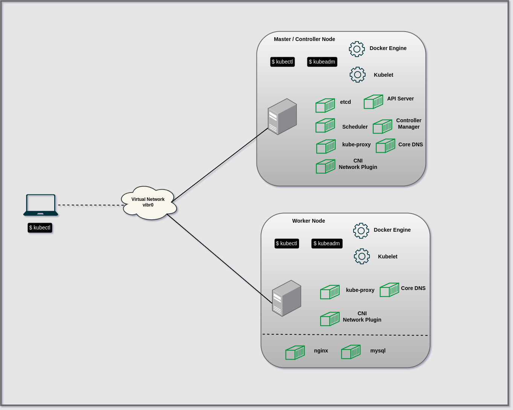

# Installation of Kubernetes Cluster (kubeadm)

## Prerequisites for Cluster

- A Linux Box e.g. Ubuntu, Debian, Redhat, CentOS
- 2GB or more RAM per machine
- 2 CPUs or more
- Full Network connectivity between all machines (Public or Private)
- Unique hostname, MAC Address, and product_uuid for every node
    
    ```bash
    # Check hostname of linux system
    $ hostname
    k8s-master-01
    
    # Check MAC Address
    $ ip link
    1: lo: <LOOPBACK,UP,LOWER_UP> mtu 65536 qdisc noqueue state UNKNOWN mode DEFAULT group default qlen 1000
        link/loopback 00:00:00:00:00:00 brd 00:00:00:00:00:00
    2: ens3: <BROADCAST,MULTICAST,UP,LOWER_UP> mtu 1500 qdisc fq_codel state UP mode DEFAULT group default qlen 1000
        link/ether 52:54:00:cc:cd:66 brd ff:ff:ff:ff:ff:ff
    
    # Check UUID
    $ sudo cat /sys/class/dmi/id/product_uuid
    54f3fa20-dc85-45f0-9675-1a274b73b7af
    
    ```
    
- Required ports should be open e.g. 6443
    
    ```bash
    $ nc 127.0.0.1 6443
    ```
    
- Swap disabled





## Features and Limitations
- Possible to create multi-node kubernetes cluster compared to minikube.
- It creates single node master. No High Availability for master node available yet.
- You can create/join one or more dedicated worker-nodes.
- Being multi-node in nature, it allows you to use multi-node features such as advance scheduling policies.
- Services of type **Load Balancer** still not possible.
- Choise of using different container engines, such as Docker, Rocket, etc. This is not possible in Minikube.
- Choice of wide variety of (CNI-based) network plugins to be used for pod networking. This is not possible in Minikube.
Supports cluster expansion, upgrades, downgrades, etc.
- Can be used as a production cluster, though extreme is advised. You should know what you are doing!


## Preparation
* **RAM**: Minimum 1 GB RAM for each node (master+worker); You will only be able to run very few (and very small) containers, like nginx, mysql etc.
* **CPU**: Minimum 2 CPUs for master node; worker nodes can live with single core CPUs
* **Disk**: 4 GB for host OS + 20 GB for storing container images
* **Network - Infrastructure**: A functional virtual/physical network with some usable IP addresses (can be public or private). This can on any cloud provider as well. You are free to use any network/IP scheme for yourself. In this guide, it will be `10.240.0.0/24`
* **Network - Pod Network**: A network IP range completely separate from other two networks, with subnet mask of `/16` or smaller (e.g. `/12`). This network will be subdivided into subnets later. In this guide it will be `10.200.0.0/16`. Please note that kubeadm does not support kubenet, so we need to use one of the CNI add-ons such as flannel. By default Flannel sets up a pod network `10.244.0.0/16`, which means that we need to this pod network to `kubeadm init`, or modify the Flannel configuration with the pod network of our own choice.
* **Network - Service network**: A network IP range completely  separate from other two networks, used by services. This will be considered a completely virtual network. The default service network configured by kubeadm is `10.96.0.0/12`. In this guide it will be 10.32.0.0/16`.
* **Firewall**: Disable firewall or open the following ports on each type of node, after the OS installation is complete.
* **Firewall/ports - Master**: Incoming open (22, 6443, 10250, 10251, 2379, 2380)
* **Firewall/ports - Worker**: Incoming open (22, 10250, 30000-32767)
* **OS** Any recent version of Fedora/CentOS or Debian based OS. This guide used Ubuntu 20.04
* **Disk Partitioning** No swap - must disable swap partition during OS installation in order for the kubelet to work properly. See: https://github.com/kubernetes/kubernetes/issues/53533 for details on why disable swap. swap may seem a good idea, it is not on Kubernetes.

## OS Setup
```shell
root@kubeadm-node01:~# cat /etc/hosts

127.0.1.1 kubeadm-node01 kubeadm-node01
127.0.0.1 localhost

# Virtual Kubernetes Cluster
192.168.122.211	kubeadm-node01
192.168.122.72	kubeadm-node02
```

```shell
root@kubeadm-node01:~# ufw status
Status: inactive
```

**Forwarding IPv4 and letting iptables see bridge traffic**
verify that `br_netfilter` module is loaded by running `lsmod | grep br_netfilter`. if not loaded then `sudo modprobe br_netfilter`.

Enable the sysctl settings `net.bridge.bridge-nf-call-iptables`
```shell
cat <<EOF >/etc/sysctl.d/k8s.conf
net.bridge.bridge-nf-call-ip6tables = 1
net.bridge.bridge-nf-call-iptables = 1
EOF
sysctl --system
```
### Install container runtime (Dcoker)
Reference Documentation: https://docs.docker.com/engine/install/ubuntu/
On all nodes (master+worker), install Docker

**Setup Repository**
1. Update the `apt` package index and install packages to allow `apt` to use a repository over https
    ```shell
    sudo apt-get update
    sudo apt-get install \
        ca-certificates \
        curl \
        gnupg \
        lsb-release
    ```
2. Add Docker's official GPG key
    ```shell
    sudo mkdir -p /etc/apt/keyrings
   curl -fsSL https://download.docker.com/linux/ubuntu/gpg | sudo gpg --dearmor -o /etc/apt/keyrings/docker.gpg
    ```
3. Use the following command to setup the repository
    ```shell
    echo \
      "deb [arch=$(dpkg --print-architecture) signed-by=/etc/apt/keyrings/docker.gpg] https://download.docker.com/linux/ubuntu \
      $(lsb_release -cs) stable" | sudo tee /etc/apt/sources.list.d/docker.list > /dev/null
    ```

**Install Docker Engine**
1. Update `apt` package index and install the latest version of Docker Engine, containerd.
    ```shell
    sudo apt-get update
    sudo apt-get install docker-ce docker-ce-cli containerd.io 
    ```
   By default, in Ubuntu, service starts and enabled, so Docker service is started and enabled to start on boot time. You can verify by running
   ```shell
    root@kubeadm-node01:~# systemctl is-enabled docker
    enabled
    ```
   ```shell
    root@kubeadm-node01:~# systemctl status docker
    ● docker.service - Docker Application Container Engine
    Loaded: loaded (/lib/systemd/system/docker.service; enabled; vendor preset: enabled)
    Active: active (running) since Sat 2022-09-17 22:49:39 IST; 15h ago
    TriggeredBy: ● docker.socket
    Docs: https://docs.docker.com
    Main PID: 14510 (dockerd)
    Tasks: 10
    Memory: 22.5M
    CGroup: /system.slice/docker.service
    └─14510 /usr/bin/dockerd -H fd:// --containerd=/run/containerd/containerd.sock
    ...
    ```

### Install kubeadm, kubelet and kubectl
on each node, install:
* kubeadm: the command to actually setup/bootstrap the cluster
* kubelet: the components that runs on the all machines in your cluster and does things like starting pods and container.
* kubelet: the command line utility to talk to your cluster

All of the above three pieces of software care available from Kubernetes repository. So first, set that up:
```shell
sudo apt-get update
sudo apt-get install -y apt-transport-https ca-certificates curl

sudo curl -fsSLo /usr/share/keyrings/kubernetes-archive-keyring.gpg https://packages.cloud.google.com/apt/doc/apt-key.gpg

echo "deb [signed-by=/usr/share/keyrings/kubernetes-archive-keyring.gpg] https://apt.kubernetes.io/ kubernetes-xenial main" | sudo tee /etc/apt/sources.list.d/kubernetes.list

sudo apt-get update
sudo apt-get install -y kubelet kubeadm kubectl
sudo apt-mark hold kubelet kubeadm kubectl
```

The above command installs additional packages, which are:
* cri-tools
* kubernetes-cni
* socat

At this time, kubelet will continuously try to start and will fail (crashloop), because it will wait for kubeadm to tell what to do. This crashloop is expected and normal. After you initialize your master (using kubeadm), the kubelet runs normally.

### Run kubeadm on node1/master to setup the cluster
SSH to master node (node1) as root, and run `kubeadm init` command. Also make a note of entire outpur of the `kubeadm init` command. This will be useful later.

```shell
kubeadm init \
  --pod-network-cidr "10.200.0.0/16" \
  --service-cidr "10.32.0.0/16"
```
**Note**: You can skip `--pod-network-cidr` and `--service-cidr`. The default for pod-network is nothing - actually depends on the CNI plugins you will be using; but if you plan to use flannel, **and** want to use flannel default configuration, then you must pass `--pod-network-cidr "10.244.0.0/15"` to the `kubeadm init`. The default for `--service-cidr` is: `10.96.0.0/12`.

so the fist attempt results in the following:
```shell
root@kubeadm-node01:~# kubeadm init   --pod-network-cidr "10.200.0.0/16"   --service-cidr "10.32.0.0/16"
[init] Using Kubernetes version: v1.25.1
[preflight] Running pre-flight checks
error execution phase preflight: [preflight] Some fatal errors occurred:
	[ERROR CRI]: container runtime is not running: output: E0918 16:04:51.407240   40017 remote_runtime.go:948] "Status from runtime service failed" err="rpc error: code = Unimplemented desc = unknown service runtime.v1alpha2.RuntimeService"
time="2022-09-18T16:04:51+05:30" level=fatal msg="getting status of runtime: rpc error: code = Unimplemented desc = unknown service runtime.v1alpha2.RuntimeService"
, error: exit status 1
[preflight] If you know what you are doing, you can make a check non-fatal with `--ignore-preflight-errors=...`
To see the stack trace of this error execute with --v=5 or higher
```

You may face the issues related to container runtime. see: https://github.com/containerd/containerd/issues/4581

```shell
sudo rm -f /etc/containerd/config.toml
sudo systemctl restart containerd
```

```shell
kubeadm init  \
  --pod-network-cidr "10.200.0.0/16"  \
  --service-cidr "10.32.0.0/16"
```

```shell
root@kubeadm-node01:~# kubeadm init   --pod-network-cidr "10.200.0.0/16"   --service-cidr "10.32.0.0/16"
[init] Using Kubernetes version: v1.25.1
[preflight] Running pre-flight checks
[preflight] Pulling images required for setting up a Kubernetes cluster
[preflight] This might take a minute or two, depending on the speed of your internet connection
[preflight] You can also perform this action in beforehand using 'kubeadm config images pull'
[certs] Using certificateDir folder "/etc/kubernetes/pki"
[certs] Generating "ca" certificate and key
[certs] Generating "apiserver" certificate and key
[certs] apiserver serving cert is signed for DNS names [kubeadm-node01 kubernetes kubernetes.default kubernetes.default.svc kubernetes.default.svc.cluster.local] and IPs [10.32.0.1 192.168.122.211]
[certs] Generating "apiserver-kubelet-client" certificate and key
[certs] Generating "front-proxy-ca" certificate and key
[certs] Generating "front-proxy-client" certificate and key
[certs] Generating "etcd/ca" certificate and key
[certs] Generating "etcd/server" certificate and key
[certs] etcd/server serving cert is signed for DNS names [kubeadm-node01 localhost] and IPs [192.168.122.211 127.0.0.1 ::1]
[certs] Generating "etcd/peer" certificate and key
[certs] etcd/peer serving cert is signed for DNS names [kubeadm-node01 localhost] and IPs [192.168.122.211 127.0.0.1 ::1]
[certs] Generating "etcd/healthcheck-client" certificate and key
[certs] Generating "apiserver-etcd-client" certificate and key
[certs] Generating "sa" key and public key
[kubeconfig] Using kubeconfig folder "/etc/kubernetes"
[kubeconfig] Writing "admin.conf" kubeconfig file
[kubeconfig] Writing "kubelet.conf" kubeconfig file
[kubeconfig] Writing "controller-manager.conf" kubeconfig file
[kubeconfig] Writing "scheduler.conf" kubeconfig file
[kubelet-start] Writing kubelet environment file with flags to file "/var/lib/kubelet/kubeadm-flags.env"
[kubelet-start] Writing kubelet configuration to file "/var/lib/kubelet/config.yaml"
[kubelet-start] Starting the kubelet
[control-plane] Using manifest folder "/etc/kubernetes/manifests"
[control-plane] Creating static Pod manifest for "kube-apiserver"
[control-plane] Creating static Pod manifest for "kube-controller-manager"
[control-plane] Creating static Pod manifest for "kube-scheduler"
[etcd] Creating static Pod manifest for local etcd in "/etc/kubernetes/manifests"
[wait-control-plane] Waiting for the kubelet to boot up the control plane as static Pods from directory "/etc/kubernetes/manifests". This can take up to 4m0s
[apiclient] All control plane components are healthy after 12.007618 seconds
[upload-config] Storing the configuration used in ConfigMap "kubeadm-config" in the "kube-system" Namespace
[kubelet] Creating a ConfigMap "kubelet-config" in namespace kube-system with the configuration for the kubelets in the cluster
[upload-certs] Skipping phase. Please see --upload-certs
[mark-control-plane] Marking the node kubeadm-node01 as control-plane by adding the labels: [node-role.kubernetes.io/control-plane node.kubernetes.io/exclude-from-external-load-balancers]
[mark-control-plane] Marking the node kubeadm-node01 as control-plane by adding the taints [node-role.kubernetes.io/control-plane:NoSchedule]
[bootstrap-token] Using token: trkt53.lrul001tgzkaqspg
[bootstrap-token] Configuring bootstrap tokens, cluster-info ConfigMap, RBAC Roles
[bootstrap-token] Configured RBAC rules to allow Node Bootstrap tokens to get nodes
[bootstrap-token] Configured RBAC rules to allow Node Bootstrap tokens to post CSRs in order for nodes to get long term certificate credentials
[bootstrap-token] Configured RBAC rules to allow the csrapprover controller automatically approve CSRs from a Node Bootstrap Token
[bootstrap-token] Configured RBAC rules to allow certificate rotation for all node client certificates in the cluster
[bootstrap-token] Creating the "cluster-info" ConfigMap in the "kube-public" namespace
[kubelet-finalize] Updating "/etc/kubernetes/kubelet.conf" to point to a rotatable kubelet client certificate and key
[addons] Applied essential addon: CoreDNS
[addons] Applied essential addon: kube-proxy

Your Kubernetes control-plane has initialized successfully!

To start using your cluster, you need to run the following as a regular user:

  mkdir -p $HOME/.kube
  sudo cp -i /etc/kubernetes/admin.conf $HOME/.kube/config
  sudo chown $(id -u):$(id -g) $HOME/.kube/config
Alternatively, if you are the root user, you can run:

  export KUBECONFIG=/etc/kubernetes/admin.conf

You should now deploy a pod network to the cluster.
Run "kubectl apply -f [podnetwork].yaml" with one of the options listed at:
  https://kubernetes.io/docs/concepts/cluster-administration/addons/

Then you can join any number of worker nodes by running the following on each as root:

kubeadm join 192.168.122.211:6443 --token trkt53.lrul001tgzkaqspg \
	--discovery-token-ca-cert-hash sha256:b629b1220ee0cea5861ce61d3639d035e0ba2e4aecc8f961dd2eb34aa42ff687 
```

```shell
amit@kubeadm-node01:~$ kubectl get services
NAME         TYPE        CLUSTER-IP   EXTERNAL-IP   PORT(S)   AGE
kubernetes   ClusterIP   10.32.0.1    <none>        443/TCP   21m
```

Check cluster components status
```shell
amit@kubeadm-node01:~$ kubectl get cs
Warning: v1 ComponentStatus is deprecated in v1.19+
NAME                 STATUS    MESSAGE                         ERROR
scheduler            Healthy   ok                              
controller-manager   Healthy   ok                              
etcd-0               Healthy   {"health":"true","reason":""}   
```

### Install pod networkcal
At this time, if you check cluster health, you will see **Master** as **NotReady**. It is because a pod network is not yet deployed on the cluster. You must install a pod network add